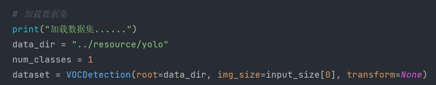
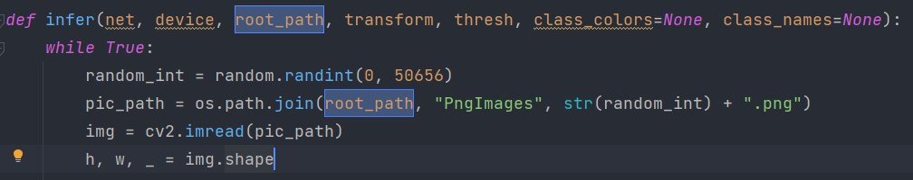
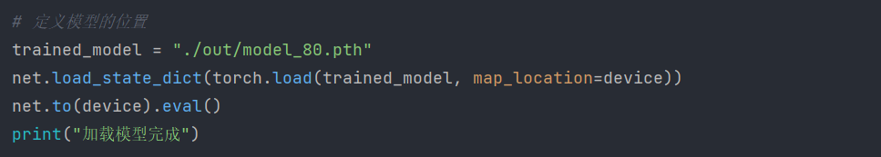

## Img2Latex

### 依赖

- pytorch
- OpenCV

### 模型文件夹

`/out`   

命名model+轮数

`/out/model_0`文件夹是我第一次训练的50轮

`/out`夹下是基于50轮继续训练的80轮的模型

### 目标公式识别

推理的话主要看`Infer.py`  

### 如何换成自己的数据集   

改这里的路径

读取图片的代码可能要改成你自己的格式

### 如何换模型

